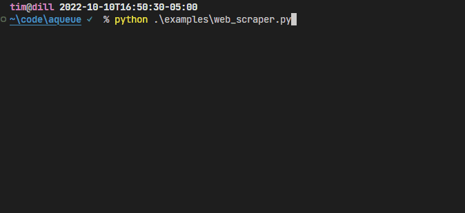

# aqueue



An async queue with live progress display. Good for running and visualizing tree-like I/O-bound
processing jobs, such as website scrapes.

## Example

```python
import random

import trio

from aqueue import EnqueueFn, Display, run_queue, Item


class RootItem(Item):
    async def process(self, enqueue: EnqueueFn, display: Display) -> None:
        num_children = 3
        display.overall.total = num_children
        display.worker.description = "Making child items"

        for _ in range(num_children):
            # simulate doing work and creating more items
            await trio.sleep(random.random())
            enqueue(ChildItem())


class ChildItem(Item):
    async def process(self, enqueue: EnqueueFn, display: Display) -> None:
        display.worker.description = "Doing work..."

        # Simulate doing work
        await trio.sleep(random.random())

        display.overall.completed += 1


def main() -> None:
    run_queue(
        initial_items=[RootItem()],
        num_workers=2,
    )


if __name__ == "__main__":
    main()

```

## Usage Notes

There's two things you need to do to use aqueue:

1. Write your [Item](#items) classes
2. [Start your queue](#starting-your-queue) with one of those items

### Items

Items are your units of work. They can represent whatever you'd like, such as parts of a website
that you're trying to scrape: an item for the index page, for subpages, for images, etc.

Each item should be an instance of a class that defines an async `progress` method. As arguments, it
should accept two positional arguments:

1. a `aqueue.EnqueueFn` that caan be called to enqueue more work. That type is simply an alias for
   `Callable[[Item], None]`.
2. a `aqueue.Display` object that gives you control of the terminal display:

```python
import aqueue

class MyItem(aqueue.Item):
    async def process(self, enqueue: aqueue.EnqueueFn, display: aqueue.Display) -> None:
        # make an HTTP request, parse it, etc
        print('My item is processing!')

        # when you discover more items you want to process, enqueue them:
        enqueue(AnotherItem())

class AnotherItem(aqueue.Item):
    async def process(self, enqueue: aqueue.EnqueueFn, display: aqueue.Display) -> None:
        print('Another item is processing!')
```

As a rule of thumb, you should make a new item class whenever you notice a one-to-many relationship.
For example, this _one_ page has _many_ images I want to download.

Note: `process` is async, but because this library uses
[Trio](https://trio.readthedocs.io/en/stable/index.html) under the hood, you may only use
Trio-compatible primitives inside `process`. For example, use `trio.sleep`, not `asyncio.sleep`.
TODO: consider [AnyIO](https://anyio.readthedocs.io/en/stable/) to avoid this problem?

Disclaimer: aqueue, or any asynchronous framework, is only going to be helpful if you're performing
work is I/O-bound.

### Starting your Queue

Then, start your queue with an initial item(s) to kick things off.

```python
aqueue.run_queue(
    initial_items=[MyItem()],
    num_workers=2,
)
```

#### Queue type

By default, the queue is actually ...a queue -- that is to say that items are processed
first-in-first-out. Here are all the types you can specify with the `queue_type_name` argument.

- `queue` - first-in-first-out processing, or breadth-first.
- `stack` - last-in-first-out processing, or depth-first. This one is recommended for website
  scraping because it yields items fast (versus `queue` that tries to look at all the intermediate
  pages first).
- `priority` - priority queue processing. In this case, your item objects should be orderable (with
  `__lt__`, etc). **Lesser objects will be processed first**, because this code uses a minheap.

#### Number of workers

You can specify the number of workers you'd like to be processing your items with the `num_workers`
argument.

#### Ctrl-C

If you decide you want to stop your queue processing, press Ctrl-C.

If you've set the `graceful_ctrl_c` to False, this will stop the program immediately. If True, the
default, aqueue will wait for the items currently being worked on to complete (without taking any
additional items), and _then_ stop. Put another way, the choice is between responsiveness and
resource consistency.

#### Setting the look of the panels

Currently, only support for configuring the "Overall Progress" panel is supported. By default, the
panel is very simple. If you want to customize it, provide an iterable of
`rich.progress.ProgressColumn` objects to the `overall_progress_columns` argument. See
<https://rich.readthedocs.io/en/stable/progress.html> for more information. (Note that rich provides
all the nice terminal visualizations for aqueue!)

### Updating the display

As mentioned, each `process` method gets called with an `aqueue.Display` object. The display has two
properties:

- `worker`, which lets you update the description of the worker who's currently processing this
  item. `display.worker.description` is the getter/setter for that.
- `overall`, which lets you access things in "Overall Progress" terminal panel.
  `display.overall.completed` is a getter/setter for the number of completed things,
  `display.overall.total` for the total number of things (or None), and `display.overall.total_f`
  for the total number of things or 0.

These panels are just an informational display for humans. They don't know about the queue churning
through items of work. Therefore, you must decide what things you want to keep track of, and often,
you won't be able to determine the complete number of things at the beginning. You'll need to do
some intermediate processing and increment it slowly as more work is discovered. For example, if you
want to keep track of images found and downloaded, you often won't be able to do that until you are
searching deeper into the website.

### Sharing state

Often, its beneficial to share state between the items. Using the website scrape example again, you
may want to keep track of the URLs you've visited so you don't scrape them twice.

If this is needed, simply keep a global set/dict/list and store a key for the item. For example, a
URL string may be a good key.

If you don't want to or can't use a global variable, consider a
[`ContextVar`](https://docs.python.org/3/library/contextvars.html).

### Persisting state

During development, its probably likely that your program will crash after doing some work. For
example, maybe your HTTP request timed out or you had a bug in your HTML parsing.

It's a shame to lose that work that's been done. So, if you're looking for a really handy way to
persist state across runs, check out the built-in
[`shelve`](https://docs.python.org/3/library/shelve.html) module. It's like a dict that
automatically saves to a file each time you set a key in it.

### Other cool things

This library is fully docstringed and type-hinted 🥳

## Installation

```shell
pip install "git+https://github.com/t-mart/aqueue"
```
