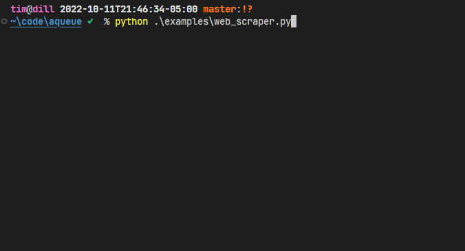

# aqueue



An async queue with live progress display. Good for running and visualizing "tree-like" processing
jobs, such as website scrapes.

## Example

```python
import random

import trio

from aqueue import EnqueueFn, ProgressDisplay, run_queue, Item


# the top-level item. it makes more items dynamically.
class RootItem(Item):
    async def process(
        self, enqueue: EnqueueFn, progress_display: ProgressDisplay
    ) -> None:
        num_children = 3
        # update the display
        progress_display.update_worker_desc("Making child items")
        progress_display.set_overall_total(num_children)

        # create some children items
        for _ in range(num_children):
            await trio.sleep(random.random())
            # call the provided enqueue function
            enqueue(ChildItem())


# a dynamically created item
class ChildItem(Item):
    async def process(
        self, enqueue: EnqueueFn, progress_display: ProgressDisplay
    ) -> None:
        progress_display.update_worker_desc("Doing work...")
        await trio.sleep(random.random())


def main() -> None:
    run_queue(
        initial_items=[RootItem()],  # set the first item to kick things off
        num_workers=2,  # run with 2 workers
    )


if __name__ == "__main__":
    main()
```

## Usage Notes

- This library is fully docstringed and type-annotated 🥳
- You design your items as classes that implement an async `process` method (see source for
  exact signature). If you'd like, your item class can inherit from `aqueue.Item`. Then, you pass
  some starting items to the queue in the `initial_items` argument.
- Any item can create more items by calling the enqueue method passed to `process`.
- You can set some things in the display by calling the `progress_display` methods. For example,
  it's probably good feedback to `progress_display.update_worker_desc("Doing something...")`.
- You may specify the queue type to be:
  - `queue` - last-in-first-out processing
  - `stack` - first-in-first-out processing
  - `priority` - priority queue processing. In this case, your objects should be orderable (with
     `__lt__`, etc). **Lesser objects will be processed first**, because this code uses a minheap.
- If you want to share some state, set a global variable or use a
  [`ContextVar`](https://docs.python.org/3/library/contextvars.html).
- All async primitives used inside items must be compatible with
  [Trio](https://trio.readthedocs.io/en/stable/index.html).
- All the terminal visualization is provided by [Rich](https://rich.readthedocs.io/). Additionally,
  the arguments to `overall_progress_columns` of `aqueue.run_queue()` are Rich objects.

## Installation

```shell
pip install "git+https://github.com/t-mart/aqueue"
```
