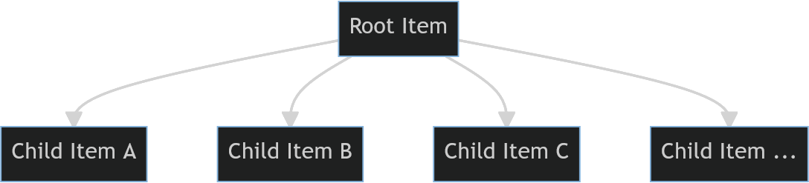

.. teaser-begin

==========
``aqueue``
==========

``aqueue`` is an async task queue with live progress display.

You put items in, and they get processed, possibly creating more items which get processed, and so
on, until all items are completed. A typical use case would be to scrape a website.

.. image:: https://raw.githubusercontent.com/t-mart/aqueue/master/docs/_static/demo.gif
  :alt: Demonstration of aqueue

.. note::

  ``aqueue``, or any asynchronous framework, is only going to be helpful if you're performing
  **I/O-bound** work.

Installation
============

``aqueue`` is a Python package `hosted on PyPI <https://pypi.org/project/aqueue/>`_. The recommended
installation method is `pip <https://pip.pypa.io/en/stable/>`_-installing into a virtual
environment:

.. code-block:: shell

   pip install aqueue

Getting Started
===============

There's two things you need to do to use aqueue:

1. Implement your `Item <https://t-mart.github.io/aqueue/#items>`_ subclasses.
2. `Start your queue <https://t-mart.github.io/aqueue/#starting-your-queue>`_ with one of those
   items.

.. teaser-end

Example
=======

If you had a hierarchy of items like this...

Then, you might process it with ``aqueue`` like this...

.. include:: examples/simple.py
   :code: python

.. code-block:: python

   import aqueue

   class RootItem(aqueue.Item):
      async def process(
         self, enqueue: aqueue.EnqueueFn, set_desc: aqueue.SetDescFn
      ) -> None:
         # display what we're doing in the worker status panel
         set_desc("Processing RootItem")

         # make an HTTP request, parse it, etc
         ...

         # when you discover more items you want to process, enqueue them:
         for _ in range(5):
               enqueue(ChildItem())

      async def after_children_processed(self) -> None:
         # run this method when this Item and all other Items it enqueued are done
         print("All done!")

   class ChildItem(aqueue.Item):

      # track the enqueueing and completion of these items in the overall panel
      track_overall: bool = True

      async def process(
         self, enqueue: aqueue.EnqueueFn, set_desc: aqueue.SetDescFn
      ) -> None:
         set_desc("Processing ChildItem")

   if __name__ == "__main__":
      aqueue.run_queue(
         initial_items=[RootItem()],
         num_workers=2,
      )

.. -project-information-

Project Information
===================

- **License**: `MIT <https://choosealicense.com/licenses/mit/>`_
- **PyPI**: https://pypi.org/project/aqueue/
- **Source Code**: https://github.com/t-mart/aqueue
- **Documentation**: https://t-mart.github.io/aqueue/
- **Supported Python Versions**: 3.10 and later
